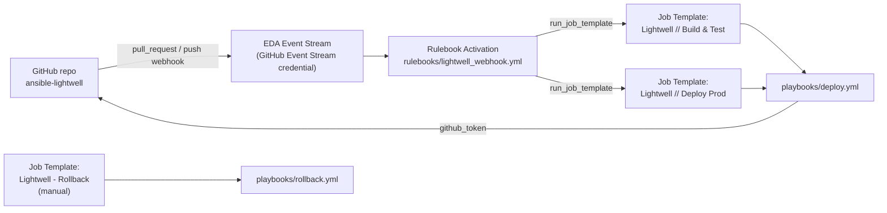

# Ansible Automation Platform Setup Guide

This guide walks through configuring Ansible Automation Platform (AAP) so
that it builds, deploys, health-checks, and (if needed) rolls back the
Lightwell demo Java application in response to GitHub pull request and
push events.

GitHub does not talk to job templates directly. Instead, all GitHub events
land on a single **Event-Driven Ansible (EDA) Event Stream**, which
forwards them to a **Rulebook Activation** that decides which job
template(s) to launch and with which extra vars. Status is reported back
to GitHub using a token minted on demand from a **GitHub App** installation,
via the `GitHub App Installation Access Token Lookup` credential -- no
static GitHub PAT is stored anywhere in this pipeline.

## Table of Contents

- [Overview](#overview)
- [Prerequisites](#prerequisites)
- [Credentials](#credentials)
  - [Lightwell Network Service Account (custom credential type)](#lightwell-network-service-account-custom-credential-type)
  - [GitHub App and status-reporting credentials](#github-app-and-status-reporting-credentials)
  - [Machine Credential](#machine-credential)
  - [Container Registry Credential (optional)](#container-registry-credential-optional)
  - [Controller API Credential (for the Rulebook Activation)](#controller-api-credential-for-the-rulebook-activation)
- [Project](#project)
- [Inventory](#inventory)
- [Job Templates](#job-templates)
  - [Lightwell // Build & Test](#lightwell--build--test)
  - [Lightwell // Deploy Prod](#lightwell--deploy-prod)
  - [Lightwell Rollback (manual)](#lightwell-rollback-manual)
- [Decision Environment](#decision-environment)
- [Event Stream & Rulebook Activation](#event-stream--rulebook-activation)
  - [Event Stream credential](#event-stream-credential)
  - [Event Stream](#event-stream)
  - [Rulebook Activation](#rulebook-activation)
  - [Configure GitHub webhook](#configure-github-webhook)
- [Branch Protection on GitHub](#branch-protection-on-github)
- [End-to-End Flow](#end-to-end-flow)
- [Demo Reset](#demo-reset)

## Overview



## Prerequisites

- An AAP instance (2.5+) with Event-Driven Ansible enabled, reachable from
  GitHub with a valid TLS certificate on its Event Stream endpoint.
- A single Podman-capable RHEL host reachable over SSH (inventory group
  `rhlw`) that both builds the app's image and hosts all `dev`/`prod`
  deployments. Each `app_environment` runs as its own Quadlet-managed
  container on its own port on that same host, per `app_port_map` in
  `inventory/group_vars/all.yml` (`8082`/`8083` for `dev`/`prod`) so they
  don't collide.
- A container registry that the AAP execution environment can push to and
  the target host can pull from, named `lightwell-java-demo` (default in
  this repo: `quay.io/lightwell-java-demo`).
- A Lightwell Network service account (username in the form
  `<account-id>|<service-account-name>`, plus a token). **Never** commit
  these values to the repository -- store them only as an AAP credential.
- A **GitHub App** installed on this repository (see
  [GitHub App and status-reporting credentials](#github-app-and-status-reporting-credentials))
  -- used instead of a personal access token so status-reporting
  credentials are short-lived and scoped to the app's own permissions.

## Credentials

Create the following credentials under **Automation Execution -> Infrastructure -> Credentials**:

### Lightwell Network Service Account (custom credential type)

AAP has no built-in credential type for Lightwell, so define one:

**Automation Execution -> Infrastructure -> Credential Types -> Add**

- Name: `Lightwell Network`
- Input configuration:

  ```yaml
  fields:
    - id: lightwell_username
      type: string
      label: Lightwell Username
    - id: lightwell_password
      type: string
      label: Lightwell Token
      secret: true
  required:
    - lightwell_username
    - lightwell_password
  ```

- Injector configuration:

  ```yaml
  extra_vars:
    lightwell_username: "{{ lightwell_username }}"
    lightwell_password: "{{ lightwell_password }}"
  ```

Then create a credential of this new type named `Lightwell Demo Service Account`
and paste in the service account username and token you were issued. This
credential is attached to the Build & Test job template -- `build_app`'s
`auth_java.yml` task writes it into a build-context Maven `settings.xml`.

### GitHub App and status-reporting credentials

Instead of a static GitHub PAT, this pipeline authenticates to GitHub as a
**GitHub App**, minting a short-lived installation access token on demand.

1. **Create the GitHub App** (GitHub org/user -> Settings -> Developer
   settings -> GitHub Apps -> New GitHub App):
   - Webhook: leave disabled here -- the [Event Stream](#event-stream)
     receives webhooks independently of the App itself.
   - Repository permissions: **Commit statuses: Read and write**,
     **Contents: Read-only**, **Metadata: Read-only**, **Issues: Read and
     write** (needed for `demo.lightwell.report_status` to post PR
     comments).
   - Generate a private key (downloads a `.pem` file) and note the **App
     ID**.
   - Install the App on the `ansible-lightwell` repository and note the
     **Installation ID** (visible in the installation's settings URL).

2. **Create the lookup credential** (Automation Execution -> Infrastructure
   -> Credentials -> Add):
   - Credential type: `GitHub App Installation Access Token Lookup`
   - GitHub App ID: the App ID from step 1
   - GitHub App Installation ID: the Installation ID from step 1
   - RSA Private Key: contents of the `.pem` file
   - Name it `Lightwell GitHub App Lookup`.

3. **Create a custom credential type** to carry the resolved token into a
   job as an extra var (Automation Execution -> Infrastructure ->
   Credential Types -> Add):
   - Name: `GitHub Status Token`
   - Input configuration:

     ```yaml
     fields:
       - id: github_token
         type: string
         label: GitHub Token
         secret: true
     required:
       - github_token
     ```

   - Injector configuration:

     ```yaml
     extra_vars:
       github_token: "{{ github_token }}"
     ```

4. **Create the target credential** of the `GitHub Status Token` type
   named `Lightwell GitHub Status Reporter`. On its `GitHub Token` field,
   click the external-credential (key) icon and link it to
   `Lightwell GitHub App Lookup` from step 2.

   In the "Select external credential" dialog:
   - **Credential**: Select `Lightwell GitHub App Lookup`.
   - **Metadata**: Leave the **Description (Optional)** field empty (or add
     a label).
   - Click **Finish**.

   AAP now resolves a fresh installation token from the GitHub App every
   time this credential is used, instead of storing a static secret.

   Attach `Lightwell GitHub Status Reporter` to both the Build & Test and
   Deploy Prod [job templates](#job-templates) --
   `demo.lightwell.report_status` reads `github_token` from it to post
   commit statuses back to GitHub.

5. **Set `aap_controller_url`** in `inventory/group_vars/all.yml` (or as an
   extra var) to this controller's base URL, e.g.
   `https://aap.example.com`. `demo.lightwell.report_status` uses it,
   together with the `awx_job_id` magic variable AAP injects automatically,
   to build a link back to the job run -- attached as the commit status's
   `target_url` and included in the PR comment it posts on `success`/
   `failure`. Leave it blank to skip these links (e.g. for manual, non-AAP
   launches).

### Machine Credential

- Type: **Machine**
- SSH credentials (or SSH key) AAP uses to reach the `rhlw` Podman host.

### Container Registry Credential (optional)

- Type: **Container Registry**
- Only needed if the registry (e.g. `quay.io/lightwell-java-demo`)
  requires authentication. Exposed as `registry_auth_file` (path to a
  podman/docker `auth.json`-format file) to the `demo.lightwell.build_app`
  role (for pushes) and the `demo.lightwell.deploy_app` role (for pulls on
  the target hosts).

### Controller API Credential (for the Rulebook Activation)

- Type: **Red Hat Ansible Automation Platform**
- A token credential the `run_job_template` action in the rulebook uses to
  call back into Controller and launch job templates. Attach it to the
  [Rulebook Activation](#rulebook-activation), not to the job templates
  themselves.

## Project

**Automation Execution -> Infrastructure -> Projects -> Add**

- Name: `ansible-lightwell`
- Source Control Type: `Git`
- Source Control URL: `git@github.com:zjleblanc/ansible-lightwell.git`
- Source Control Branch/Tag/Commit: leave blank so job templates can
  override the checkout ref per-run (needed for pull-request builds).
- Source Control Refspec: `+refs/pull/*:refs/remotes/origin/pull/*` -- by
  default `git fetch` only retrieves `refs/heads/*` and `refs/tags/*`, so
  without this refspec GitHub's `refs/pull/<number>/head` refs are never
  fetched and the `scm_branch` override the rulebook supplies for PR
  builds (see [Rulebook Activation](#rulebook-activation)) cannot be
  resolved.
- Update Revision on Launch: enabled

This same project (and checkout) also supplies the rulebook at
`rulebooks/lightwell_webhook.yml` -- create a matching **EDA Project**
under **Automation Decisions -> Projects** pointing at the same
repository URL so the rulebook is available to Rulebook Activations.

## Inventory

**Automation Execution -> Infrastructure -> Inventories -> Add**

- Name: `lightwell-demo`
- Add a single `rhlw` group containing the Podman host -- mirror
  `inventory/hosts.yml` in this repo, or import it directly as a
  source-controlled inventory pointed at the same project. This one host
  is used for building the app's image and for all `dev`/`prod`
  deployments.
- Attach the [Machine Credential](#machine-credential) from above.

## Job Templates

Job templates are no longer launched by GitHub directly -- they're
launched by the Rulebook Activation's `run_job_template` action (see
[Event Stream & Rulebook Activation](#event-stream--rulebook-activation)),
so **no webhook configuration is needed on the job templates themselves**.

### Lightwell // Build & Test

| Field | Value |
| --- | --- |
| Inventory | `lightwell-demo` |
| Project | `ansible-lightwell` |
| Playbook | `playbooks/deploy.yml` |
| Credentials | Lightwell Demo Service Account, Machine, Container Registry (if used), Lightwell GitHub Status Reporter |
| Limit | `rhlw` |
| Source Control Branch/Tag/Commit override | Prompt on launch -- for PR builds the rulebook supplies `scm_branch: pull/<number>/head`, the PR branch's actual head commit. (Do not use GitHub's `pull/<number>/merge` ref here -- it's a test-merge commit that GitHub computes asynchronously and can lag several commits behind after a push, so the build can silently check out stale code.) For [Demo Reset](#demo-reset) pushes the rulebook instead supplies `scm_branch: "{{ event.payload.after }}"` -- the exact push commit SHA, matching `app_git_sha` -- rather than the symbolic `main` branch, so the project sync can't resolve to a later commit that lands on `main` before the sync runs. |
| Extra Variables | Prompt on launch (the rulebook supplies `app_environment: dev`, `app_git_sha`, `github_repo_full_name`, `github_pr_number`) |

### Lightwell // Deploy Prod

| Field | Value |
| --- | --- |
| Inventory | `lightwell-demo` |
| Project | `ansible-lightwell` |
| Playbook | `playbooks/deploy.yml` |
| Credentials | Lightwell Demo Service Account, Machine, Container Registry (if used), Lightwell GitHub Status Reporter |
| Source Control Branch/Tag/Commit override | Prompt on launch -- the rulebook supplies `scm_branch: "{{ event.payload.after }}"`, the exact merge commit SHA (matching `app_git_sha`), rather than the symbolic `main` branch, so the project checkout can't drift to a later commit that lands on `main` before the sync runs. This builds from the merge commit (not the PR's dev image) and gets a fresh project sync now that the project's own Update Revision on Launch is disabled |
| Limit | `rhlw` |
| Extra Variables | Prompt on launch (the rulebook supplies `app_environment: prod`, `app_git_sha`, `github_repo_full_name`) |

### Lightwell Rollback (manual)

| Field | Value |
| --- | --- |
| Inventory | `lightwell-demo` |
| Project | `ansible-lightwell` |
| Playbook | `playbooks/rollback.yml` |
| Credentials | Machine |
| Extra Variables | `target_environment` prompted on launch (`dev`/`prod`) |

No webhook or Event Stream needed -- this template is for on-demand
manual rollback.

## Decision Environment

**Automation Decisions -> Decision Environments -> Add**

- Name: `lightwell-decision-environment`
- Image: the default EDA decision environment image is sufficient for this
  demo (it already includes `ansible.eda`). Only build a custom one if you
  need additional collections inside the rulebook's own container.

## Event Stream & Rulebook Activation

This replaces per-job-template webhooks with a single, centrally managed
entry point.

### Event Stream credential

**Automation Decisions -> Infrastructure -> Credentials -> Create credential**

- Credential type: `GitHub Event Stream` (a specialization of the HMAC
  event stream type -- GitHub's signature header defaults are pre-filled)
- HMAC Secret: generate a strong random string and save it -- you will
  reuse it as the webhook secret in
  [Configure GitHub webhook](#configure-github-webhook) below
- Name it `Lightwell GitHub Event Stream Credential`

The GitHub Event Stream credential uses HMAC to verify that every incoming
webhook payload genuinely originated from GitHub and has not been tampered
with in transit. See [Red Hat docs -- Creating an event stream credential][rh-es-cred].

### Event Stream

**Automation Decisions -> Event Streams -> Create event stream**

- Name: `lightwell-github-events`
- Event stream type: `GitHub`
- Credential: `Lightwell GitHub Event Stream Credential`
- Headers: `X-GitHub-Event, X-GitHub-Delivery` (only the headers your
  rulebook conditions and actions need -- avoid `*` in production)
- Forward events to rulebook activation: **enabled**

After saving, copy the generated **payload URL** -- you will paste it into
the GitHub webhook in [Configure GitHub webhook](#configure-github-webhook).
See [Red Hat docs -- Creating an event stream][rh-es].

> **Tip:** Leave *Forward events to rulebook activation* **disabled**
> initially so you can confirm connectivity and inspect sample payloads on
> the Event Stream's detail page before events reach the rulebook. Toggle
> it on once the webhook is delivering successfully.

### Rulebook Activation

**Automation Decisions -> Rulebook Activations -> Create rulebook activation**

- Name: `Lightwell Patch Pipeline Router`
- Project: the EDA project from [Project](#project)
- Rulebook: `rulebooks/lightwell_webhook.yml`
- Event streams: click the gear icon to open the source-mapping UI and map
  the rulebook's `github_webhook` source to `lightwell-github-events`.
  This replaces the rulebook's `ansible.eda.webhook` source with
  `ansible.eda.pg_listener`, routing events from the Event Stream into the
  rulebook. Only the source type, name, and arguments are swapped --
  filters, rules, conditions, and actions remain unchanged.
- Credentials: the Controller API credential from
  [Controller API Credential (for the Rulebook Activation)](#controller-api-credential-for-the-rulebook-activation)
  (required by `run_job_template` to launch job templates)
- Decision environment: `lightwell-decision-environment`
- Restart policy: `On failure`

The rulebook contains one rule per event, so a single PR or push event
triggers a single `run_job_template` launch. The playbook independently
decides whether there are file changes to build (see the root
[README's path-based filtering section](../README.md#path-based-filtering-only-deploy-when-app-files-change)).

See [Red Hat docs -- Replacing sources and attaching event streams to activations][rh-es-attach].

### Configure GitHub webhook

In the GitHub repository: **Settings -> Webhooks -> Add webhook**

- Payload URL: the Event Stream payload URL copied from
  [Event Stream](#event-stream) above
- Content type: `application/json`
- Secret: the same HMAC secret you generated for the `GitHub Event Stream`
  credential in [Event Stream credential](#event-stream-credential) above
- Events: select **Pull requests** and **Pushes** (one webhook covers
  both flows -- the rulebook's conditions decide which job template to
  launch)

After adding the webhook, GitHub sends a test `ping` payload. Verify on
the Event Stream's detail page in AAP that it was received (the *Events
received* counter increments and the header/body are visible). See
[Red Hat docs -- Configuring your remote system to send events][rh-es-remote]
and [Verifying your event streams work][rh-es-verify].

[rh-es-cred]: https://docs.redhat.com/en/documentation/red_hat_ansible_automation_platform/2.5/html/using_automation_decisions/simplified-event-routing#proc-eda-set-up-credential
[rh-es]: https://docs.redhat.com/en/documentation/red_hat_ansible_automation_platform/2.5/html/using_automation_decisions/simplified-event-routing#proc-eda-set-up-new-event-stream
[rh-es-attach]: https://docs.redhat.com/en/documentation/red_hat_ansible_automation_platform/2.5/html/using_automation_decisions/simplified-event-routing#proc-eda-set-up-rulebook-activation
[rh-es-remote]: https://docs.redhat.com/en/documentation/red_hat_ansible_automation_platform/2.5/html/using_automation_decisions/simplified-event-routing#event-stream-configure-remote
[rh-es-verify]: https://docs.redhat.com/en/documentation/red_hat_ansible_automation_platform/2.5/html/using_automation_decisions/simplified-event-routing#event-stream-verify

## Branch Protection on GitHub

**Settings -> Branches -> Add rule** for `main`:

- Require a pull request before merging
- Require approvals (at least 1)
- Require status checks to pass before merging -- select the
  `ci/lightwell-java-dev` context (posted by
  `demo.lightwell.report_status` from `playbooks/deploy.yml`, using the
  token from the `Lightwell GitHub Status Reporter` credential).

This is what enforces the "successful test leads to a PR to main with
approval requirements" step of the pipeline.

## End-to-End Flow

1. Renovate scans the app's dependency manifest (`apps/java/pom.xml`)
   against its Lightwell Remediated index and opens a PR bumping a
   remediated package to a `.rhlw-0000X` version.
2. GitHub sends a `pull_request` webhook to the Event Stream, which
   forwards it to the `Lightwell Patch Pipeline Router` rulebook
   activation.
3. The rulebook matches the `opened`/`synchronize`/`reopened` condition
   and launches `Lightwell // Build & Test` with `app_git_sha`,
   `github_repo_full_name`, and `github_pr_number` from the payload.
4. `playbooks/deploy.yml` checks whether the PR actually touched
   `apps/java/` files; if not, it posts a "Skipped" success status and
   exits early. Otherwise it marks the `ci/lightwell-java-dev` status
   `pending`, builds the image from the PR branch's head commit
   (`scm_branch: pull/<number>/head`), deploys/health-checks it in `dev`,
   then reports `success` or `failure` back to GitHub using the GitHub App
   installation token -- including a `target_url` pointing at the AAP job
   run, and a PR comment summarizing the result with a link to that same
   job run.
5. Branch protection blocks merging until the required `ci/lightwell-
   java-dev` check passes and a reviewer approves; a reviewer then merges
   the PR into `main`.
6. GitHub sends a `push` webhook to the same Event Stream; the rulebook
   matches the `refs/heads/main` condition and launches `Lightwell //
   Deploy Prod` with the merge commit SHA.
7. `playbooks/deploy.yml` again checks whether `apps/java/` files
   actually changed in the merge commit; if so, it rebuilds the image from
   the merged `main` branch (rather than reusing the dev image), so the
   merge integrates cleanly with whatever else landed on `main`. The image
   is tagged with both the merge commit SHA and `latest`, and both tags
   are pushed. It then deploys the commit-SHA-tagged image to `prod`,
   health-checks it, and reports status back to GitHub (context
   `ci/lightwell-java-prod`) the same way.
8. If the prod health check fails, the playbook automatically rolls back
   to the previously running image, re-checks health, and reports the
   final outcome -- surfacing as a failed AAP job for alerting if the
   rollback itself doesn't come back healthy.

## Demo Reset

To re-run the demo, downgrade the remediated package in
`apps/java/pom.xml` (e.g. `org.json:json` to an earlier version), delete
Renovate's open branch for that update (its name starts with
`renovate/java-`, per `additionalBranchPrefix` in `renovate.json` -- check
the exact name on the open PR), and push to `main` with a commit message
starting with `Reset`:

```
git push origin --delete renovate/java-<branch-suffix-from-the-open-pr>
git commit -am "Reset demo dependencies"
git push origin main
```

This triggers two things:

1. The `Rebuild dev image on demo reset push` rule matches the `Reset`
   commit message and immediately rebuilds/redeploys the `dev`
   environment from the exact push commit on `main` (pinned via
   `scm_branch`, matching `app_git_sha`) -- no PR needed.
2. Renovate re-detects the downgraded package and opens a new PR on its
   next scheduled run (`before 7am` America/Chicago per `renovate.json`),
   or trigger it manually if demoing outside that window.
